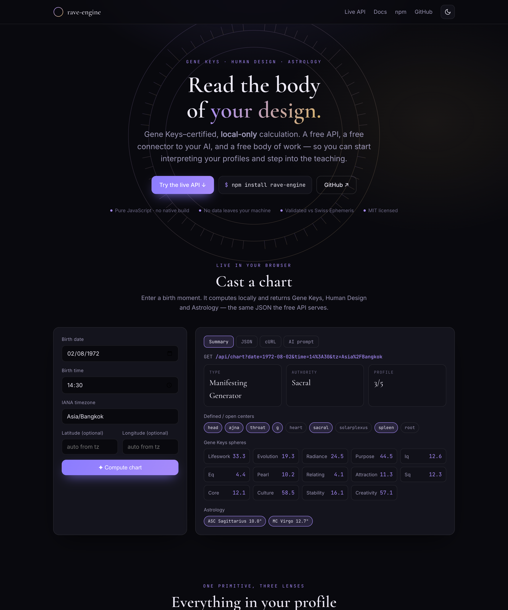
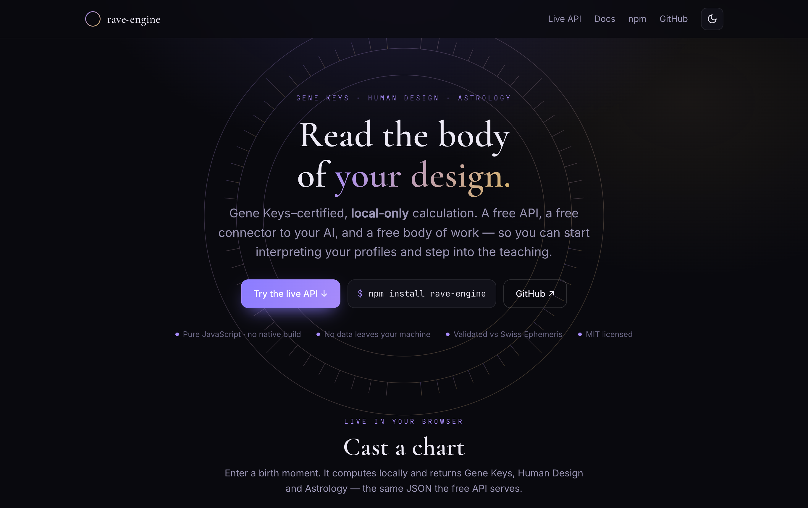
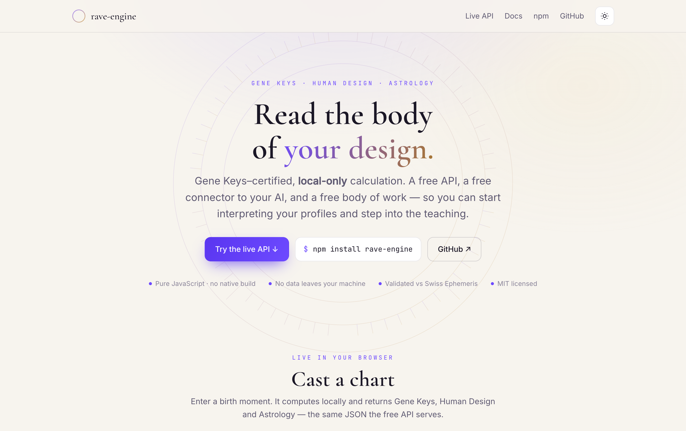

# rave-engine

[](https://www.npmjs.com/package/rave-engine)
[](#tests)
[](#tests)
[](LICENSE)
[](package.json)
[](#accuracy--precision)

**A pure-JavaScript Human Design & Gene Keys engine — with extended astrology - from the maintainer of official Gene Keys Profiler and Event Horizon Election Engine, and Gene Key's Integral Human Design.**

From a birth date, time and timezone (and an optional location), `rave-engine`
computes:

- 🧬 **Gene Keys** — the gene key (hexagram) + line for every sphere of the
  Hologenetic Profile (`lifeswork`, `purpose`, `pearl`, `iq`, `eq`, …).
- ⚡ **Human Design** — the full bodygraph: every planetary gate activation
  (13 bodies × Personality + Design), **activated gates**, **defined channels**,
  **defined centers**, **open centers**, and the derived **Type**, **Authority**
  and **Profile**.
- 🪐 **Astrology** — **Ascendant**, **Descendant**, **Midheaven (MC)**,
  **IC**, and house cusps (**Placidus**, **Whole Sign** or **Equal**).

It is **pure JavaScript** — no native build, no `node-gyp`, and **no ephemeris
data files**. Planetary positions come from the MIT-licensed
[`astronomia`](https://github.com/commenthol/astronomia) package (VSOP87 + lunar
theory), validated to the exact gate/line against Swiss Ephemeris.

<p align="center">
  
</p>

```bash
npm install rave-engine
```

---

## Quickstart

```js
const { computeChart } = require('rave-engine');

const chart = computeChart({
  birthdate: '1972-08-02',   // YYYY-MM-DD (or YYYY-M-D)
  birthtime: '14:30',        // HH:mm (or H:mm, or HH:mm:ss)
  timezone: 'Asia/Bangkok',  // any IANA timezone
  // location: { lat: 13.75, lng: 100.5 }, // optional — see "Location" below
  // houseSystem: 'placidus',              // 'placidus' | 'whole' | 'equal'
});

console.log(chart.humanDesign.type);          // 'Manifesting Generator'
console.log(chart.humanDesign.authority);     // 'Sacral'
console.log(chart.humanDesign.profile);       // '3/5'
console.log(chart.geneKeys.spheres.lifeswork); // { gk: 33, line: 3 }
console.log(chart.astrology.angles.ascendant.sign); // 'Sagittarius'
```

`computeChart` returns three coherent sections:

```jsonc
{
  "input": {
    "birthdate": "1972-08-02", "birthtime": "14:30", "timezone": "Asia/Bangkok",
    "birth_utc": "1972-08-02T07:30:00.000Z",
    "location": { "lat": 13.75, "lng": 100.51, "city": "Bangkok", "source": "timezone-city" }
  },

  "geneKeys": {
    "spheres": {
      "lifeswork": { "gk": 33, "line": 3 },
      "evolution": { "gk": 19, "line": 3 },
      "radiance":  { "gk": 24, "line": 5 },
      "purpose":   { "gk": 44, "line": 5 },
      "iq": { "gk": 12, "line": 6 }, "eq": { "gk": 4, "line": 4 },
      "pearl": { "gk": 10, "line": 2 }, "relating": { "gk": 4, "line": 1 },
      "attraction": { "gk": 11, "line": 3 }, "sq": { "gk": 12, "line": 3 },
      "core": { "gk": 12, "line": 1 }, "culture": { "gk": 58, "line": 5 },
      "stability": { "gk": 16, "line": 1 }, "creativity": { "gk": 57, "line": 1 }
    }
  },

  "humanDesign": {
    "type": "Manifesting Generator",
    "authority": "Sacral",
    "profile": "3/5",
    "definitionCount": 6,
    "activatedGates": [4, 10, 11, 12, 16, 19, 24, 33, 34, 44, 45, 48, 51, 56, 57, 58, 60, 61, 62],
    "definedChannels": [{ "key": "34-57", "gates": [34, 57], "centers": ["sacral", "spleen"], "name": "Power" }, "…"],
    "definedCenters": ["head", "ajna", "throat", "g", "sacral", "spleen"],
    "openCenters": ["heart", "solarplexus", "root"],
    "centers": { "head": true, "ajna": true, "…": "…" },
    "p_": { "sun": { "gate": 33, "line": 3, "color": 4, "retrograde": false, "longitude": 130.09, "…": "…" }, "…": "…" },
    "d_": { "…": "…" },
    "activations": { "personality": [ "…13 bodies…" ], "design": [ "…13 bodies…" ] }
  },

  "astrology": {
    "location": { "lat": 13.75, "lng": 100.51, "city": "Bangkok" },
    "angles": {
      "ascendant":  { "longitude": 249.97, "sign": "Sagittarius", "degInSign": 9.97, "gateLine": { "gate": 9, "line": 5 } },
      "descendant": { "sign": "Gemini",      "…": "…" },
      "mc":         { "sign": "Virgo",       "…": "…" },
      "ic":         { "sign": "Pisces",      "…": "…" }
    },
    "houses": { "system": "placidus", "cusps": [ { "house": 1, "longitude": 249.97, "sign": "Sagittarius" }, "…" ] }
  }
}
```

If no location can be resolved, `astrology` is `null` (everything else still
computes — astrology is the only part that needs a place of birth).

---

## 🌐 Free API & live site

**[rave-engine.netlify.app](https://rave-engine.netlify.app)** — a free, local-only
API and an in-browser playground. Every endpoint is a plain `GET` with open CORS,
so you can call it from a browser, a notebook, or hand it straight to an AI.

<p align="center">
  
</p>

```bash
curl "https://rave-engine.netlify.app/api/chart?date=1972-08-02&time=14:30&tz=Asia/Bangkok"
```

| Endpoint | Returns |
| --- | --- |
| `/api/chart` | Full chart — Gene Keys + Human Design + Astrology |
| `/api/genekeys` | Gene Keys spheres |
| `/api/humandesign` | Human Design bodygraph |
| `/api/astrology` | Ascendant / MC / houses |
| `/api/prompt` | A ready-to-paste **AI interpretation prompt** |
| `/api/timezones?q=bali` | IANA timezone search |

Params: `date=YYYY-MM-DD` · `time=HH:mm` · `tz=IANA` · `[lat lng house=placidus|whole|equal]`

Dark and light, fully responsive:

| Dark | Light |
| --- | --- |
|  |  |

The site and API live in [`site/`](site) and [`netlify/functions/`](netlify/functions);
the deploy config is [`netlify.toml`](netlify.toml). Nothing about a birth ever
leaves the function — the ephemeris is computed in-process.

---

## The three layers

### 🧬 Gene Keys (the spheres)

<p align="center">
  
</p>

Each sphere is keyed by its gene key (`gk`, the I-Ching hexagram 1–64) and line
(1–6), mapped from a planet at the Personality (birth) or Design (~88° of solar
arc before birth) moment:

| Sphere | Source | Sphere | Source |
| --- | --- | --- | --- |
| `lifeswork` | Personality Sun | `attraction` | Design Moon |
| `evolution` | Personality Earth | `sq` | Design Venus |
| `radiance` | Design Sun | `core` | Design Mars |
| `purpose` | Design Earth | `culture` | Design Jupiter |
| `iq` | Personality Venus | `stability` | Design Saturn |
| `eq` | Personality Mars | `creativity` | Design Uranus |
| `pearl` | Personality Jupiter | `relating` | Personality Mercury |

### ⚡ Human Design (the bodygraph)

The bodygraph is derived from **26 activations** — 13 bodies (Sun, Earth, Moon,
North/South Node, Mercury, Venus, Mars, Jupiter, Saturn, Uranus, Neptune, Pluto)
at both the Personality and Design moments:

```js
const { computeChart } = require('rave-engine');
const hd = computeChart({ birthdate: '1972-08-02', birthtime: '14:30', timezone: 'Asia/Bangkok' }).humanDesign;

hd.activatedGates;   // [4, 10, 11, … ]  — every gate lit by a planet
hd.definedChannels;  // channels where BOTH gates are activated
hd.definedCenters;   // centers touched by a defined channel
hd.openCenters;      // the rest
hd.type;             // Generator | Manifesting Generator | Projector | Manifestor | Reflector
hd.authority;        // Emotional | Sacral | Splenic | Ego | Self-Projected | Mental | Lunar
hd.profile;          // e.g. '3/5'  (Personality Sun line / Design Sun line)
```

Reference data (gate→center map and the 36 channels) is the standard Human
Design bodygraph and is exported for your own use:

```js
const { GATE_CENTER, CHANNELS, CENTERS, computeBodygraph } = require('rave-engine');
```

### 🪐 Astrology (angles & houses)

```js
const { computeAngles, computeHouses } = require('rave-engine');

const angles = computeAngles({ jdUT: 2441531.8125, lat: 13.75, lng: 100.5 });
// { ascendant, descendant, mc, ic }  — each with longitude, sign, degInSign, gateLine

const houses = computeHouses({ jdUT: 2441531.8125, lat: 13.75, lng: 100.5, system: 'placidus' });
// { system, cusps: [{ house, longitude, sign, degInSign }, …], angles }
```

Angles and houses need only sidereal time + obliquity (no ephemeris). Placidus
falls back to Whole Sign above the polar circle, where it is mathematically
undefined.

---

## Location

The astrology section needs a **place of birth**. You have two options:

1. **Explicit coordinates** (most accurate):
   ```js
   computeChart({ /* … */ location: { lat: 13.7563, lng: 100.5018 } });
   ```
2. **Just the timezone** — `rave-engine` derives a representative location from
   the most-populous city in that timezone, which is plenty for an Ascendant:
   ```js
   computeChart({ birthdate, birthtime, timezone: 'Asia/Bangkok' });
   // → location { city: 'Bangkok', lat: 13.75, lng: 100.51, source: 'timezone-city' }
   ```

Coordinates use **north-positive latitude** and **east-positive longitude**.

### Historical timezones

Birth charts are historical, so the engine honours the **full IANA history** of
each zone — not just modern rules. Offsets resolve through
[Luxon](https://moment.github.io/luxon/) against the runtime's IANA/ICU tz
database, which correctly handles 20th-century edge cases such as US year-round
DST in 1974, British Double Summer Time (1944/1947 = UTC+2), Poland skipping DST
in 1970, Nepal's 1986 switch to UTC+5:45, and pre-standardisation Local Mean
Time. These are regression-locked in
[`test/timezone-history.test.js`](test/timezone-history.test.js).

> Accuracy of historical offsets depends on the tz database in your JS runtime.
> Use a current Node.js (full ICU is the default since Node 13) for complete
> 20th-century coverage. Nonexistent local times (spring-forward gaps) shift
> forward into DST; ambiguous times (fall-back overlaps) resolve to the earlier
> offset.

### Timezone autocomplete

```js
const { searchTimezones, locationForTimezone } = require('rave-engine');

searchTimezones('bali');   // → [{ ianaName: 'Asia/Makassar', mainCity: 'Makassar', … }]
searchTimezones('tokyo');  // → [{ ianaName: 'Asia/Tokyo', currentOffsetMinutes: 540, … }]
locationForTimezone('Europe/London'); // → { lat: 51.5, lng: -0.12, city: 'London', … }
```

---

## CLI

```bash
# Full chart (readable summary)
npx rave --chart --date 1972-08-02 --time 14:30 --tz Asia/Bangkok

# With explicit coordinates and a house system, as JSON
npx rave --chart --date 1972-08-02 --time 14:30 --tz Asia/Bangkok \
  --lat 13.75 --lng 100.5 --house whole --json

# Classic profile (p_/d_ + spheres)
npx rave --date 1972-08-02 --time 14:30 --tz Asia/Bangkok

# Timezone search
npx rave --tz-search bali
```

---

## Accuracy & precision

Planetary positions come from `astronomia` (VSOP87 + lunar theory) and match
Swiss Ephemeris to well within a Gene Keys **line** (0.9375°): typically `<1″`
for the Sun and planets and `~10″` for the Moon. The gate/line/retrograde output
is regression-locked against Swiss Ephemeris golden vectors (see
[`test/profile.test.js`](test/profile.test.js)) **and validated against five
real charts from a third-party calculator** — 125 of 130 body activations match
to the exact gate.line, with the remainder within a single line (design-Moon
timing, true-node algorithm and sub-line ephemeris differences between
calculators). See [`test/reference-charts.test.js`](test/reference-charts.test.js).

Lunar nodes use the **true node** (oscillating), matching mainstream Human
Design calculators.

### Optional high-precision backend

If you want Swiss Ephemeris precision (and accept its AGPL/commercial license),
install it yourself and opt in — it is **not** a dependency of this package:

```bash
npm install swisseph        # native build; provide ephemeris files via EPHE_PATH
EPHE_BACKEND=swisseph node your-app.js
```

`rave-engine` auto-detects it and falls back to the pure-JS backend if it isn't
available.

---

## API

| Export | Returns |
| --- | --- |
| `computeChart(input)` | Full `{ input, geneKeys, humanDesign, astrology, _meta }` |
| `computeProfile(input)` | `{ input, engine: { p_, d_, spheres, _meta } }` (back-compat) |
| `computeBodygraph(activations)` | `{ type, authority, profile, activatedGates, definedChannels, definedCenters, openCenters, centers, … }` |
| `computeActivations({ birthUtc })` | The 26 raw activations (`{ personality, design }`) |
| `computeAngles({ jdUT, lat, lng })` | `{ ascendant, descendant, mc, ic }` |
| `computeHouses({ jdUT, lat, lng, system })` | `{ system, cusps, angles }` |
| `searchTimezones(query, { limit })` | Ranked IANA zones with offsets + city hints |
| `locationForTimezone(iana)` | Representative `{ lat, lng, city, country }` |
| `parseBirthToUtc({ birthdate, birthtime, timezone })` | UTC `Date` |
| `mapLongitudeDegrees(lon)` | `{ hexagram, line, color }` |

Also exported: `GATE_CENTER`, `CHANNELS`, `CENTERS`, `signOf`, `SIGNS`,
`resolveLocation`, `getBackend`.

---

## Tests

```bash
npm test               # run the suite
npm run coverage       # run with a coverage report
npm run coverage:badge # refresh the coverage badge above from a fresh run
```

200+ tests covering: the mandala mapping, regression-locked profiles, the
bodygraph reference data + derivation, the astronomia backend, the astrology
angles/houses (verified against the horizon/meridian geometry), the location
lookup, the end-to-end chart, **five real reference charts** from a third-party
Swiss-Ephemeris calculator, and **historical IANA timezone offsets** across the
20th century.

---

## License

MIT © Adam Blvck / Blvck Studios. See [LICENSE](LICENSE) and [NOTICE](NOTICE)
for third-party attributions.
